Mobile is the world’s biggest computing platform now a days. Not only its reach is unique, developing for mobile is also uniquely challenging. There are many DevOps tools used in mobile automation. I'm writing this blog from my recent experiance in setting up Contineous Integration and Contineous Delivery on one of android mobile application project using Bitrise + Fastlane. I tried to explain step by step and included code I used and mention what each line of code is.

I assume you already understand CI and CD and advantageous of automation. if not look at https://opensource.com/article/18/8/what-cicd.

## What is Fastlane


Fastlane is an open source platform aimed at simplifying Android and iOS deployment. Fastlane lets you automate every aspect of your development and release workflow.

For further reference and understanding fastlane go to https://docs.fastlane.tools/

Let's assume there is an android project using [git version controlling system](https://proudgeekk.wordpress.com/2013/08/23/git-simple-guide/).

## Add Fastlane to the Android project.
Follow this link to setup fastlane in your project
https://docs.fastlane.tools/getting-started/android/setup/

Setup the lanes based on your need.

### What all we have in our Fastfile

The Fastfile stores the automation configuration that can be run with fastlane.
The Fastfile has to be inside your ./fastlane directory.


We used dotenv to pass the environment variable incase we execute Fastlane locally, don’t forget to add the .env file in .gitignore.

```ruby
fastlane_require 'dotenv'
```
Follow this link to know how to use dotenv
http://fastlanescreencast.com/episodes/2-using-dotenv-and-environment-variables-in-fastlane

### How to update lokalise from fastlane

Lokalise is a translation management system built for agile teams wanting to automate their localization processes.

We used a custom action for fastlane to invoke lokalise, which can be accessed from this https://github.com/lokalise/lokalise-fastlane-actions/blob/master/lokalise.rb. We invoke the action as below.

```ruby
private_lane :update_lokalise do
    lokalise(
        api_token: ENV['lokalise_api_token'],
        project_identifier: ENV['lokalise_project_id'],
        destination: './app/src/main/res/',
        clean_destination: false
    )
end
```
This will keep the string.xml files updated each time the workflow is updated.

### How to use badge plugin to keep version badge on build.

It also use the plugin [badge](https://github.com/HazAT/badge) to update app icon with a version badge.

Install the gem ``sudo gem install badge``

To get started with fastlane-plugin-badge ``fastlane add_plugin badge``

Now you can use below code in Fastfile,

```ruby
puts 'Adding ' + ENV['version_code'] + ' badge to launcher icon'
    add_badge(
    shield: "#{ENV['version_code']}-orange",
    glob: '/app/src/main/res/**/ic_launche**.{png,PNG}',
    no_badge: true)
```

For further reference and knowledge go to https://github.com/HazAT/fastlane-plugin-badge.

## Assemble build with gradle action?


I don't think it is required to explain about gradle to you, but still..

Gradle is an open-source build automation tool that is designed to be flexible enough to build almost any type of software, and android studio build system is based on Gradle, and fastlane got a gradle action to run tasks, you can see that in example code.

```ruby
# Build process
    gradle(
    task: 'clean assembleRelease',
    properties: { 'versionCode' => ENV['version_code'].to_i })
```

### How to use slack action in fastlane.

Notifying is an important part in CI, slack is a wellknown collaboration workspace and fastlane have inbuilt action available for sharing success or error messages to slack.

```ruby
slack(
      message: ENV['change_log'],
      channel: ENV['slack_channel'],
      success: True,
      slack_url: ENV['slack_url'])
```

For further reference go to https://docs.fastlane.tools/actions/slack/

### Share build to crashalytics from fastlane

Upload a new build to Crashlytics Beta using crashalytics action available in fastlane.

```ruby
# Share build to crashalytics
crashlytics(api_token: ENV['fabric_api_token'],
            build_secret: ENV['fabric_build_secret'],
            notes: notes,
            groups: ENV['group'])
```

For further reference go to https://docs.fastlane.tools/actions/crashlytics/

### Deploy apk to playstore

There is an inbuilt action **upload_to_play_store** which deploy to playstore, and it can be used as below. Ofcourse you need to configure Google Playstore API in the project before you are able to use this.

```ruby
desc 'Deploy a new version to the Google Play'
  lane :deploy do
    gradle(task: 'clean assembleRelease')
    upload_to_play_store
    end
```

For further reference go to https://docs.fastlane.tools/getting-started/android/release-deployment/


## Complete fastfile

```ruby
# This file contains the fastlane.tools configuration

fastlane_require 'dotenv'
default_platform(:android)

before_all do
  update_fastlane
  Dotenv.overload 'secret.env'
end

platform :android do
  desc 'Runs all the checks'
  lane :checks do
    #replace string resource from lokalise before running any checks
    puts 'fetching strings.xml from lokalise'
    update_lokalise

    puts 'Checking code style'
    gradle(task: 'checkstyle')
    puts 'Finding bugs'
    gradle(task: 'findbugs')
  end

  desc 'Submit a new Beta Build to Crashlytics Beta'
  lane :beta do

    checks
    #format single quoted env var to double quoted
    notes = ENV['change_log']
    notes = notes.split("\\n").join("\n")

    puts 'Adding ' + ENV['version_code'] + ' badge to launcher icon'
    add_badge(
    shield: "#{ENV['version_code']}-orange",
    glob: '/app/src/main/res/**/ic_launche**.{png,PNG}',
    no_badge: true)

    # Build process
    gradle(
    task: 'clean assembleRelease',
    properties: { 'versionCode' => ENV['version_code'].to_i })

    # Share build to crashalytics
    crashlytics(api_token: ENV['fabric_api_token'],
                build_secret: ENV['fabric_build_secret'],
                notes: notes,
                groups: "haddaf")

    # Clean Repo as badge updated the code
    clean_changes

  end

  desc 'Deploy a new version to the Google Play'
  lane :deploy do
    gradle(task: 'clean assembleRelease')
    upload_to_play_store
  end

  private_lane :slack_message do |options|
    slack(
      message: options[:message],
      channel: ENV['slack_channel'],
      success: options[:success],
      slack_url: ENV['slack_url'])
  end

  desc 'Clean changes to existing files'
  private_lane :clean_changes do
    reset_git_repo(force: true, skip_clean: true)
  end

  private_lane :update_lokalise do
    lokalise(
        api_token: ENV['lokalise_api_token'],
        project_identifier: ENV['lokalise_project_id'],
        destination: './app/src/main/res/',
        clean_destination: false
    )
  end
end

```

In this example you can find three fastlane lanes created checks,beta and deploy. 

``checks`` is used to invoke code checking tasks like check code style, naming and syntax check, unit test, ui test etc.

``beta`` is is used to share a release build to crashalytics, it is calling the checks lane internaly, reading the enviornment variable 'change_log' to pass as release note to crashalytic using crashalytics action available in fastlane.

``deploy`` is generating a release build and deploying to google play store, We can setup one more steps in any lanes as per the requirement.

# What is Bitrise

Bitrise is a continuous integration platform focusing mainly on mobile development. Continuous integration (CI) being a commonly accepted practice of merging developer build copies to a shared mainline on a specific schedule. In other words, it is a workflow for version control and copies deployment without losing track of the development process.
Bitrise allows creating multiple workflows consisting of build steps. One app can have multiple workflows defined for it, as well as the webhooks to specify which workflow is selected for which trigger (webhook). The triggers mapped to workflows initiate builds with predefined workflows.
Build steps are programmed to perform a wide variety of functions implemented by command line scripts. All the virtual machine build steps are logged to keep the information of every step of the workflow.

I've listed the steps We added in our workflow and mentioned why it is used, but you can arrange your workflow in better way than this list, you will know it once you start working with bitrise.

For further reference and understanding bitrise go to https://devcenter.bitrise.io/getting-started

# Create an app in Bitrise

- Open Bitrise dashboard, find Add new app button.

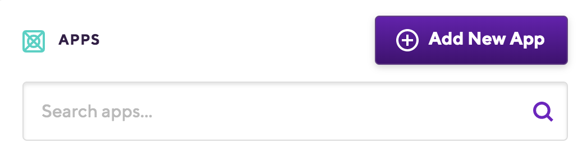 

- Click Add new app button, and configure accordingly.

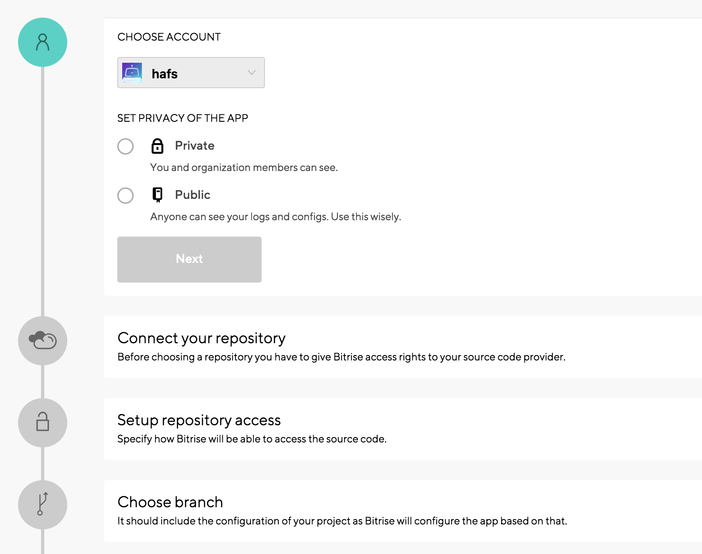 

Here we specify the remote repository and branch,  so bitrise can access the repo. Also we add SSH key from Bitrise to repository config to enable proper access validation.

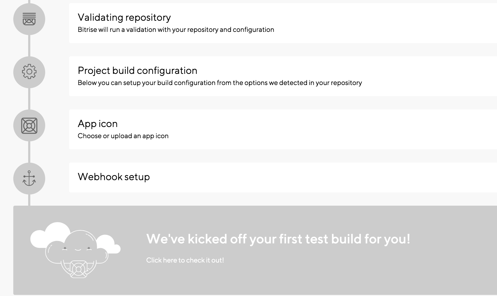 

We can also setup the incoming webhook from here which trigger the workflow, but it can be setted up later also.

For further understanding please go through https://devcenter.bitrise.io/getting-started/getting-started-with-android-apps/

# What is inside bitrise app

You can find a tab bar at the top.

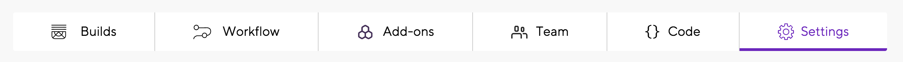

## Builds
Here we monitor each build status, check logs, reports.

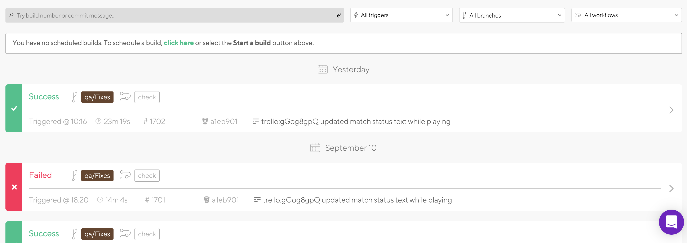

We can click on each build and open to check the logs and other onformations about the build.

## Add-ons

To enable bitrise add on features if required.

## Team

This is an administration tab to Manage Group and team members.

## Code

It manages build trigger api configurations, incoming and outgoing webhooks.
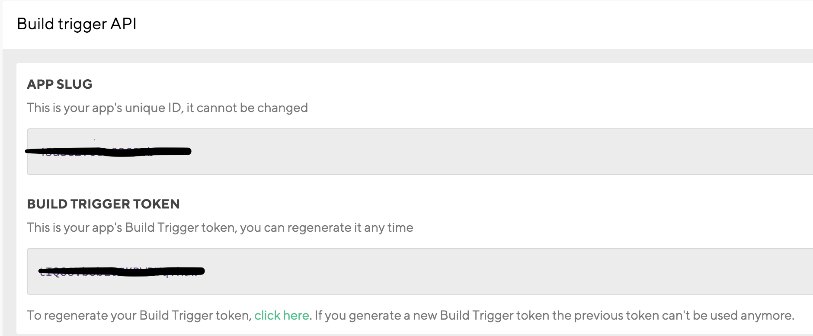 <br/>
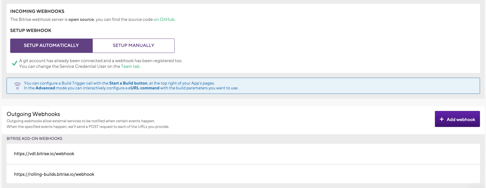 

## Setting

Here you can see and update app details like title, repo url and branch.

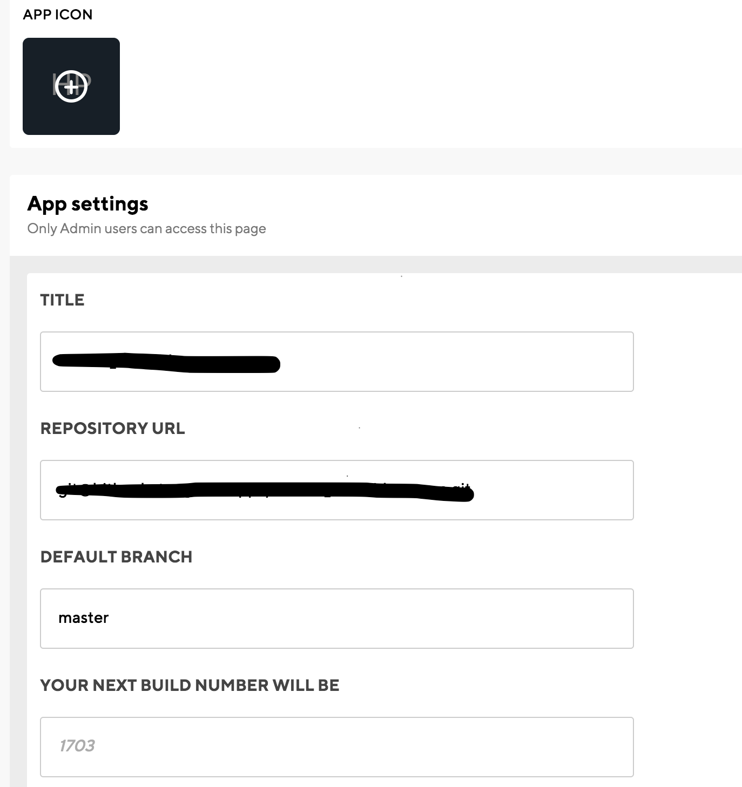 

Also you can see **YOUR NEXT BUILD NUMBER WILL BE**

This build number is handled by Bitrise it get incremented for each build, and we can update default value to start with.

You can access this value with key **BITRISE_BUILD_NUMBER**

You can also implement build number with your own custom implemntation as a step in bitrise or through fastlane.

## Workflow

It open a new tab menu with **Workflows, Code Signing, Secrets, Env Vars, Triggers, Stack and bitrise.yml**

### Code Signing

We can utilise this area to keep Android Keystore file and other generic files if any.

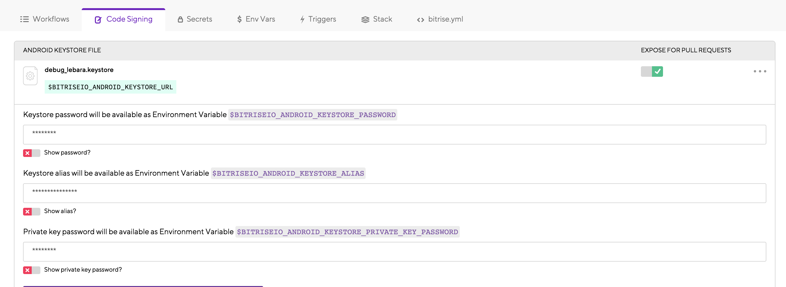

### Secrets

We can use it to store private variables, like API keys and secrets or any other credentials.

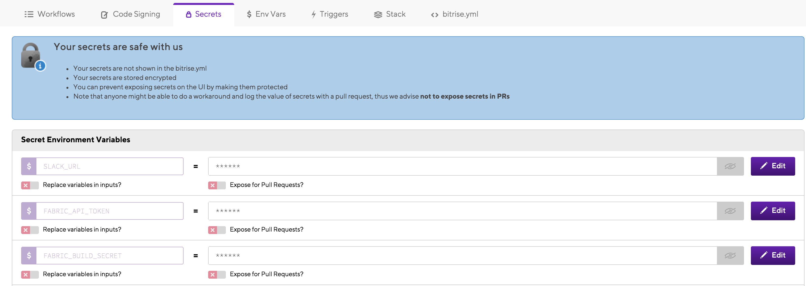

### Env Vars

App Environment Variables will also be available in builds triggered by pull requests. You should NOT add any private information here.

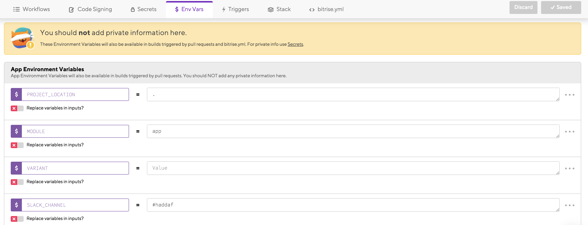

### Triggers

You can map a workflow for push, pull and tag as you require.

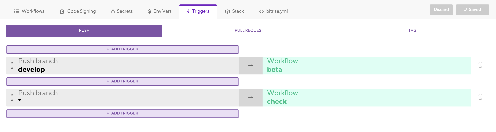

### Stack

There are different stacks for iOS build, Android build.There are Hybrid Stacks which build iOS as well as android. Different environment can be set for different workflows.

### bitrise.yml

All workflows are saved to a bitrise.yml file, that can be edited from here directly with this yml editor, also you can download this YML and run it directly with bitrise CLI locally.

### Workflows

The **Workflows** tab allows you to modify the steps, tools, and apps you'd like to use for each build process. When creating an app, Bitrise generates **primary**and **deploy** workflows by default, we can use as it is or customise it.

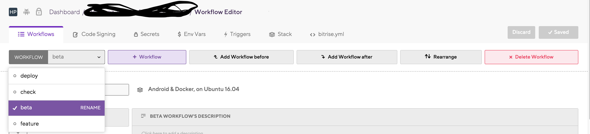

Here we add and manage different steps in workflow, there are many pre_built steps are available that we can just add and use.

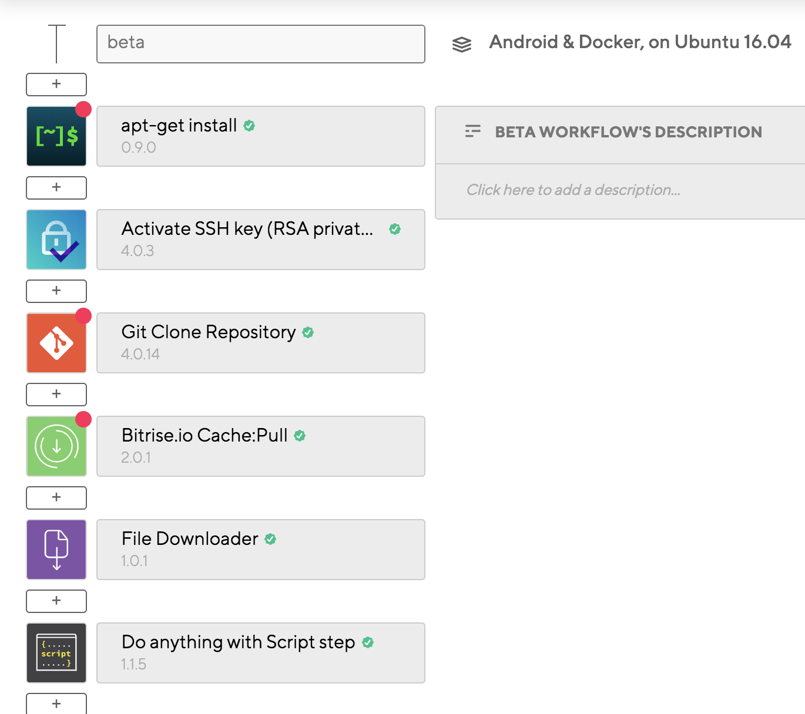

In case if there  is any task that is not available in the steps,
we can create custom step,
we can script in do anything with script step,
We can implement it with other tools like fastlane which bitrise support.

###Install or upgrade packages required Step

There are many different steps avaialble that we can be used for same purpose, We used **apt-get install**, it is available in fastlane android steps listed.

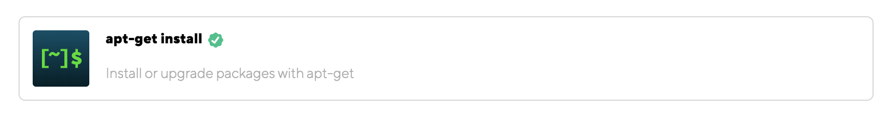

Pass below package name as input as it is a dependency for badge. 

 ```
 libcurl4-openssl-dev
 ```

### Activate SSH key (RSA private key) Step

This added by default when you finish create app step in bitrise, that you add SSH key in bitrise to give access to the repository.

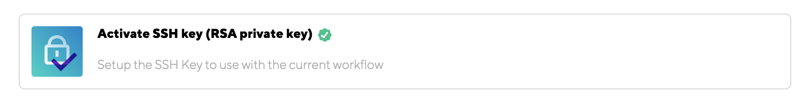

### Git Clone Repository Step

This step clone the configured project to bitrise when the flow run, added when you finish your app configuration.

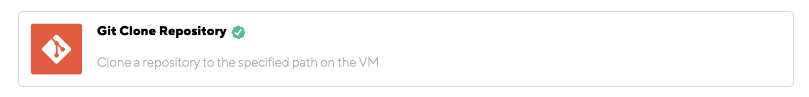

### Bitrise.io Cache:Pull Step

It is for caching the build to reduce cyclic process when not required.

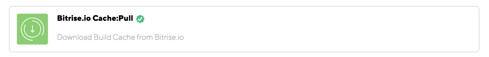

Downloads the Build Cache from Bitrise.io, and moves the files back to their original place.

You can find a setup and tips & tricks guide on the Bitrise DevCenter at http://devcenter.bitrise.io/caching/about-caching/.

### Download release key Step

We have placed release key in bitrise, we already have release key in local machine and gradle access that from certain path, so we can place the release key in same path inside bitrise also using this step **File Downloader**

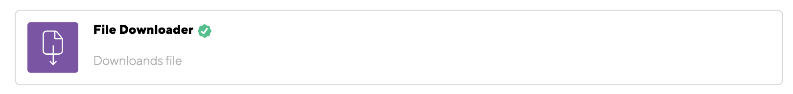


### Do anything with script Step

It is a step available in bitrise where we write bash commands. Please refer the complete script below.

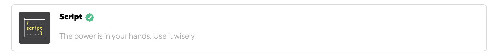

```bash
#!/usr/bin/env bash

#copy android licences
mkdir -p "$ANDROID_HOME/licenses"
rsync -avhP ./android-licenses/ "$ANDROID_HOME/licenses/"

#expose env variables to other steps
envman add --key version_code --value "${BITRISE_BUILD_NUMBER}"
envman add --key fabric_api_token --value "${FABRIC_API_TOKEN}"
envman add --key fabric_build_secret --value "${FABRIC_BUILD_SECRET}"

sudo gem install bundler --force
sudo gem install badge
bundle update fastlane

git version

RELEASE_NOTE=$(bash release_notes_generator.sh)
envman add --key change_log --value "$RELEASE_NOTE"

```

As Bitrise do the build process on the specified branch, we have to set up all the dependencies in Bitrise environment also.

As we are on android project, If you have accepted the license agreements on one workstation, but wish to build your projects on a different one, you can export your licenses by copying the accepted licenses folder from the Android SDK Home folder (this should be located at /licenses) of your current workstation, to the Android SDK Home directory of the machine where you now want to build your projects.

```bash
#copy android licences
mkdir -p "$ANDROID_HOME/licenses"
rsync -avhP ./android-licenses/ "$ANDROID_HOME/licenses/"
```
Badge need to be installed as we have a badge action inside fastlane.

```bash
sudo gem install badge 
```

We have added **libcurl4-openssl-dev** in an **apt-get install** step, badge requires that dependency .

Below I pasted an error appeared in Bitrise when trying to build with **Android &Docker, on Ubuntu 16.04**.

    Install Fastlane with bundler
    $ bundle "install" "--jobs" "20" "--retry" "5"
    You must use Bundler 2 or greater with this lockfile.
    Command failed, error: exit status 20

Based on below link I added command to install bundler with  force and update faslane
https://discuss.bitrise.io/t/you-must-use-bundler-2-or-greater-with-this-lockfile/7747/6
 
    sudo gem install bundler --force
    bundle update fastlane

Also called update fastlane from script as we are going to run fastlane from a coming step.

### Expose enviornmental variables to other steps from bitrise  

By default we cannot access env variables in fastlane step so we need to expose it some how to fastlane as we access below mentioned variables from fastlane added in Bitrise.

```bash
#expose env variables to other steps
envman add --key version_code --value "${BITRISE_BUILD_NUMBER}"
envman add --key fabric_api_token --value "${FABRIC_API_TOKEN}"
envman add --key fabric_build_secret --value "${FABRIC_BUILD_SECRET}"
envman add --key change_log --value "$RELEASE_NOTE"
```

Follow this link to learn how to expose env var from bitrise
https://devcenter.bitrise.io/tips-and-tricks/expose-environment-variable

### Generate release notes

In above bash script you can see a line as
 ```bash RELEASE_NOTE=$(bash release_notes_generator.sh)```
There is a bash script file which generate release note.

Below command generate release_note from master to current HEAD and assign to an env variable that can be accessed from other steps.

Follow this link to learn more about **git log**
https://git-scm.com/docs/git-log.

```
LOGS=$(git log --pretty="format: %s" master..HEAD | sed -e 's/$/|/'| tr -d '\n')
```
   
The complete **release_notes_generator.sh** as below

```bash
#! /bin/bash

# fetch all and ignore the output.
# Fetch all is needed to get the master branch needed in the git log command.
git fetch --all >  /dev/null 2>&1

# Because we are in a different branch the master, we need to track the master
# branch locally.
# Also ignore the ouput.
git branch --set-upstream master origin/master > /dev/null 2>&1

#fetch commit logs after last tag with given prefix
LOGS=$(git log --pretty="format: %s" master..HEAD | sed -e 's/$/|/'| tr -d '\n')
RELEASE_NOTE=''
OTHER_NOTE=''

O=$IFS
IFS='|'
shopt -s nocasematch
for i in ${LOGS[@]}
do
  if [[ $i == *"trello:"* ]]; then
    trelloid=$(echo $i | cut -d':' -f 2 | cut -d' ' -f 1 )
    prefix="https://trello.com/c/"
    temp="${prefix}""${trelloid}\n"
    RELEASE_NOTE=$RELEASE_NOTE$temp
  else
    OTHER_NOTE=$OTHER_NOTE$"$i, "
  fi
done
IFS=$O

if [[ ! -z "$OTHER_NOTE" ]]; then
  other="Other notes."
  RELEASE_NOTE=$RELEASE_NOTE$other
fi

if [[ -z "$RELEASE_NOTE" ]]; then
  RELEASE_NOTE="No release notes generated"
fi

echo "$RELEASE_NOTE"
```

To know more about bash scripting go to https://linuxhint.com/bash_scripting_tutorial_beginners/

### Install missing SDK components Step

This step makes sure that required Android SDK components (platforms and build-tools) are installed.

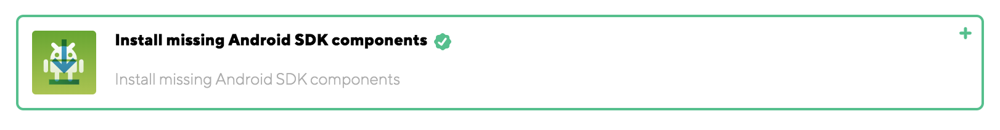

The step runs the gradlew dependencies command.

It is available in bitrise, you can just add it from the list. 

### Fastlane Step

Runs your fastlane lane.

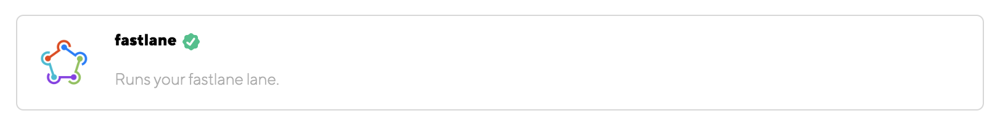

If Gemfile exists in the work_dir directory, fastlane will be used by calling bundle install then bundle exec.

Otherwise the system installed fastlane version will be used.

It is available in bitrise, you can just add it from the list.

### Android Unit Test Step

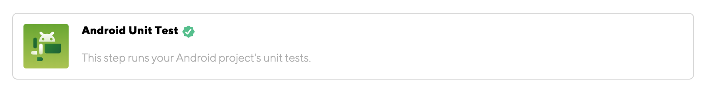

This step runs your Android project's unit tests, you can run unit test from fastlane also.

It is available in bitrise, you can just add it from the list.

### Android Build for UI Testing Step

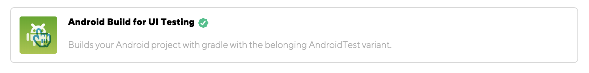

Builds your Android project with gradle with the belonging AndroidTest variant.
It is available in bitrise, you can just add it from the list.

This step will generate output variables that you can use in **Virtual device testing** step as input, BITRISE_APK_PATH and BITRISE_TEST_APK_PATH.


### [BETA] Virtual device testing Step

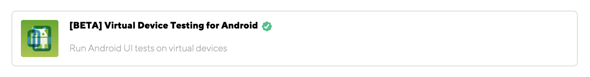

Run Android UI tests on virtual devices. Available test types are instrumentation, robo, gameloop. The minimal setup of this step would be to select test type. If you selected instrumentation, don't forget to set Test APK path under the Instrumentation Test group and Test Runner class as well.

I've used **Cucumber + espresso with robot pattern** to implement our UI tests, I'll be writing a blog soon to show you guys how it is done.

### Deploy to bitrise.io Step

This generic artifacts deployer attaches the artifacts to bitrise.io builds.

You'll see the deployed files in the Apps and Artifacts section of the build's page on bitrise.io.

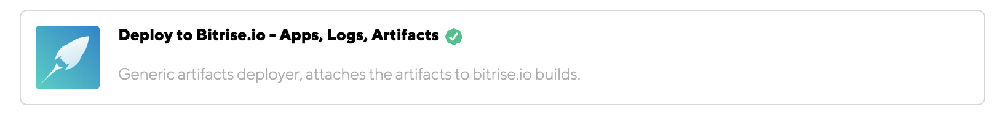

### Send to slack Step

Send a Slack message to a channel or group.

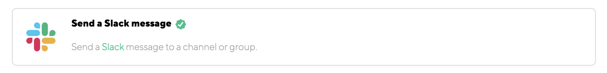

You can either setup a bot user with API token or setup Incoming WebHook integration.

To register an Incoming WebHook integration visit: https://api.slack.com/incoming-webhooks

To setup a bot with an API token visit: https://api.slack.com/bot-users

Don't forget to enable this Step to Always run if you want to get notified about failed builds as well!

### Bitrise.io cache push Step

This Step checks whether the Cache have to be updated (based on the Cache Paths and Ignore Paths from change check inputs), and if it have to be it will create a new cache archive and upload it.

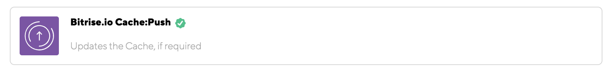

It won't update/upload the Cache if the Cache did not change, nor in case of Pull Request builds (unless you change the run_if property of the Step).

You can find a setup and tips & tricks guide on the Bitrise DevCenter at http://devcenter.bitrise.io/caching/about-caching/.

**Hope it helped you in setting up CI & CD automation on your latest project.**

**If you find any mistakes or things to update, please let me know and I'll be happy to make the changes.**  Thank you.


